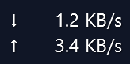
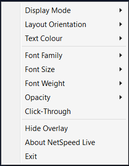
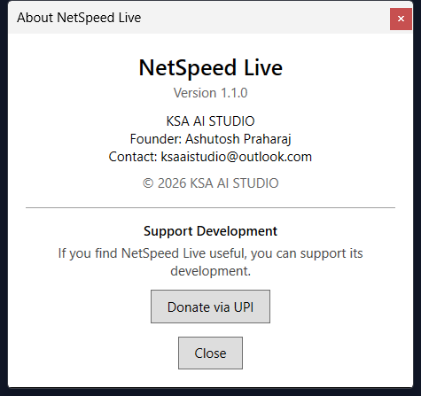
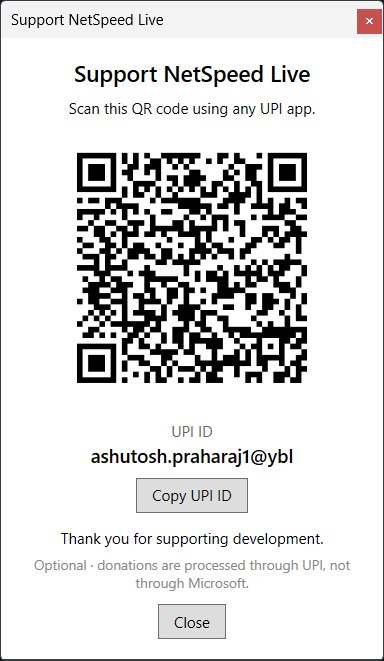

# NetSpeed Live

A lightweight Windows utility that shows real-time **download** and **upload**
network speeds in a compact, always-on-top overlay.

```text
⬇ Download first →
```

**NetSpeed Live** monitors local network traffic and displays the speed on top
of your other windows — unobtrusively, with the **download speed shown first**
and **upload second**:

| Horizontal (default) | Vertical |
|---|---|
| `⬇ 14.82 MB/s   ⬆ 2.35 MB/s` | `⬇ 14.82 MB/s`<br>`⬆ 2.35 MB/s` |

Built with **C# / .NET 8 / WPF** by **KSA AI STUDIO**.

---

## Screenshots

| Horizontal overlay | Vertical overlay |
|---|---|
|  |  |

| Context menu | About | Donation |
|---|---|---|
|  |  |  |

## Features

- **Real-time monitoring** — upload/download from per-interface byte deltas,
  ~1 s updates, loopback/virtual-adapter filtering, adapter-churn safe.
- **Download-first display** — `⬇ Download` before `⬆ Upload` in both
  orientations, in every display mode.
- **Horizontal and vertical layouts** — switch from the context menu.
- **Display modes** — Both / Only Upload / Only Download (no empty gap).
- **Always-on-top transparent overlay** — borderless, not in the taskbar,
  content-sized, drag to position with persistence and multi-monitor-safe
  restore.
- **System tray** — Show/Hide Overlay, Start with Windows, Click-Through,
  About, Exit; closing the overlay hides it to the tray.
- **Click-through mode** — mouse input passes through the overlay
  (`WS_EX_TRANSPARENT`) while it stays visible.
- **Start with Windows** — registers the published executable under
  `HKCU\...\CurrentVersion\Run` (no admin; development builds never register).
- **Appearance** — font family, size (Small/Medium/Large), weight, colour,
  opacity (50/75/100%).
- **About window** — product, version, studio, founder, contact, read from
  assembly metadata.
- **Optional UPI donation** — offline QR (QRCoder) + Copy UPI ID.
- **Signal Radar icon** — navy rounded square, radar arcs, green download /
  orange upload arrows; multi-resolution 16–256 px.
- **Settings persistence** — JSON in `%APPDATA%\NetPulseOverlay\settings.json`
  (atomic writes; corrupt/missing files fall back to defaults).

## Installation

1. Run `NetSpeedLive-Setup-1.1.0.exe` (from `Release/`).
2. Follow the wizard — per-user install, **no administrator rights required**,
   into `%LOCALAPPDATA%\Programs\NetSpeed Live\`.
3. Launch from the **Start Menu → NetSpeed Live**, the finish page, or the
   optional desktop shortcut.
4. Uninstall from **Windows Settings → Apps → Installed apps → NetSpeed Live**
   (settings are preserved across uninstall/reinstall).

An optional **portable** package (`NetSpeedLive-1.1.0-win-x64.zip`) is
available for advanced users; it needs no installer.

## Usage

- Launch NetSpeed Live — the overlay appears.
- **Drag** the overlay to move it; the position is remembered.
- **Right-click** the overlay for the context menu (display mode, orientation,
  appearance, click-through, hide, about, exit).
- **Double-click** the tray icon to re-show a hidden overlay.

## Settings & controls

- Right-click overlay → **Display Mode**, **Layout Orientation**, **Text
  Colour**, **Font Family / Size / Weight**, **Opacity**.
- Tray menu → **Show Overlay**, **Hide Overlay**, **Start with Windows**,
  **Click-Through**, **About NetSpeed Live**, **Exit**.

## Start with Windows

Controlled **inside the application** (tray menu or overlay context menu →
*Start with Windows*). The installer never registers a startup entry; enable it
in-app after installation.

## Building from source

```powershell
# Release build (this machine's SDK is user-local)
& "$env:USERPROFILE\.dotnet\dotnet.exe" build NetPulseOverlay.csproj -c Release

# Self-contained win-x64 publish (what the installer packages)
powershell -ExecutionPolicy Bypass -File Build\Publish.ps1

# Installer (requires Inno Setup 6)
& "$env:LOCALAPPDATA\Programs\Inno Setup 6\ISCC.exe" Installer\NetSpeedLive.iss
```

See `Build\README.md` and `Installer\README.md` for the pipeline.

## Release verification

Release assets (installer + SHA-256 checksum, portable ZIP, release notes) and
the GitHub release checklist live under `Release\`. Code-signing status and the
future signing pipeline are documented in `Build\CODE-SIGNING.md`. Release
notes are in `Release\RELEASE-NOTES-1.1.0.md`.

## Privacy

NetSpeed Live monitors **local network interface byte counters** to compute
upload and download speeds. It does **not** require an account, does not phone
home, and works fully offline.

For donations, the UPI QR code is **generated locally on your machine**
(offline, via QRCoder); the QR payload contains the configured UPI payment
information. No payment data is sent anywhere by the application.

## Donations

Development is supported on an optional basis through the in-app **Donate via
UPI** option (**About → Donate via UPI**). Donations are entirely optional and
processed through UPI, not through Microsoft.

## License

© 2026 KSA AI STUDIO. This project is currently distributed without an
open-source license — see `LICENSE-STATUS.md`.

## Credits

- **Author**: Ashutosh Praharaj
- **Studio**: KSA AI STUDIO
- **Contact**: ksaaistudio@outlook.com
- **QR generation**: [QRCoder](https://github.com/codebude/QRCoder) (offline, MIT)
